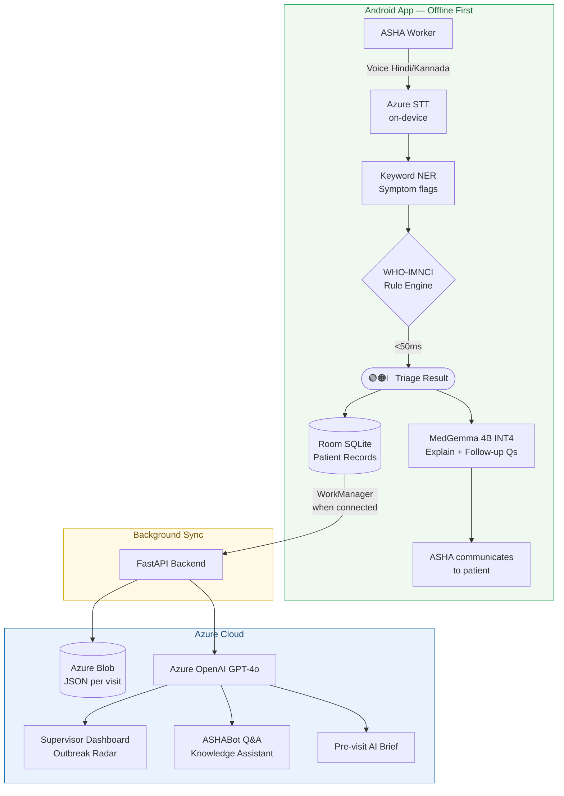
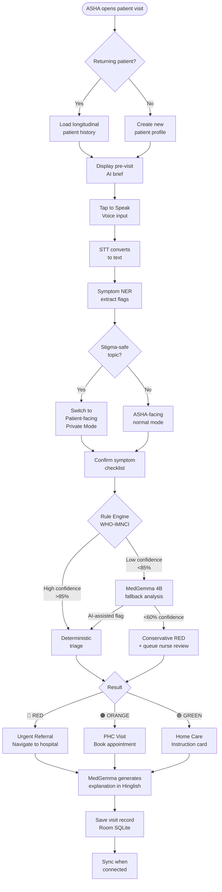
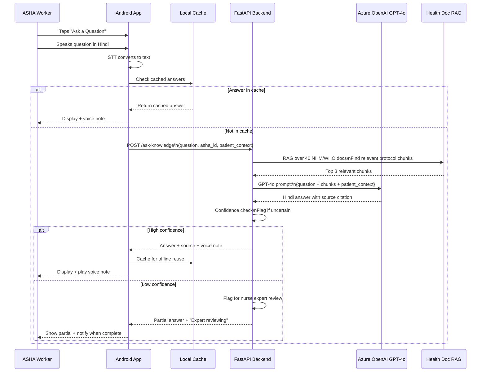
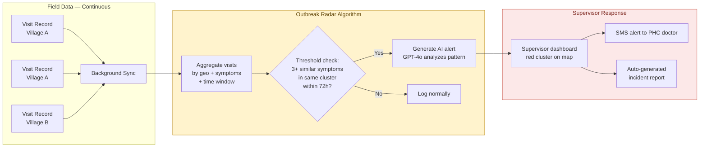
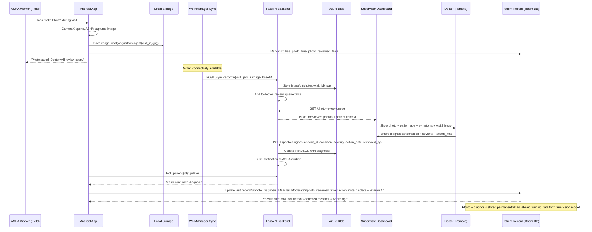
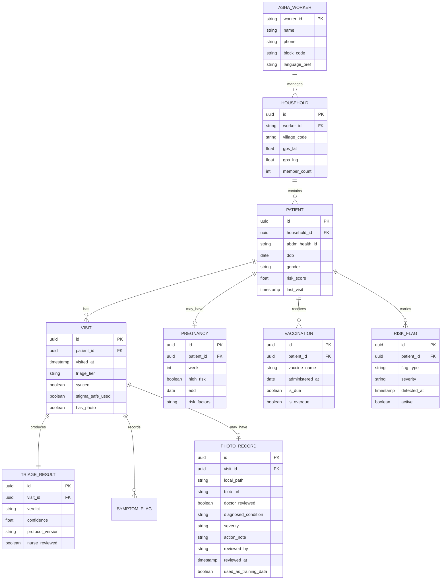
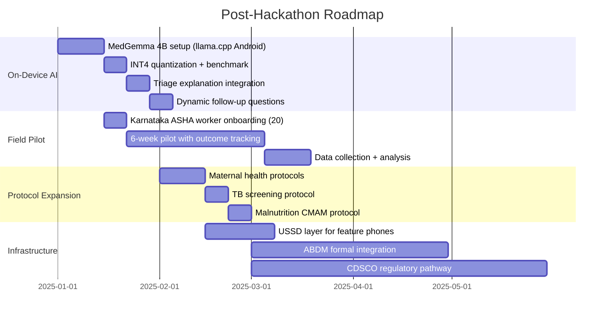
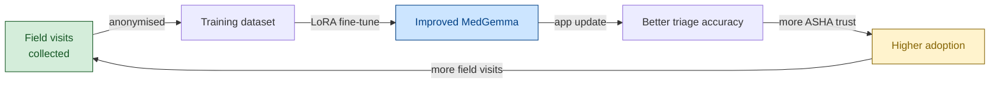

# Swasthya Sahayak 2.0 — Hackathon Master Plan
> AI UNLOCKED · Microsoft · IIM Bangalore  
> Team: Product Geeks · Target: Win

---

## Table of Contents
1. [Problem Statement](#1-problem-statement)
2. [What We Are Solving](#2-what-we-are-solving)
3. [How We Are Solving It](#3-how-we-are-solving-it)
4. [X-Factors — The Wow Moments](#4-x-factors--the-wow-moments)
5. [Architecture](#5-architecture)
6. [Diagrams](#6-diagrams)
7. [Phased Implementation Plan](#7-phased-implementation-plan)
8. [Hackathon Realism Check](#8-hackathon-realism-check)
9. [Future Roadmap](#9-future-roadmap)
10. [Demo Script](#10-demo-script)

---

## 1. Problem Statement

India has **10 lakh (1 million) ASHA workers** serving over **600 million rural patients**. These frontline workers are the only healthcare touchpoint for families in villages — responsible for everything from child immunisation to high-risk pregnancy tracking to disease surveillance.

**The brutal reality today:**

| Problem | Impact |
|---|---|
| Workers rely on memory and printed checklists | 50% of critical cases go undetected until too late |
| No offline clinical decision tool exists | Wrong escalations, missed referrals, inconsistent care |
| Patients avoid disclosing sensitive symptoms (stigma) | Critical conditions unreported |
| No digital patient records | No history, every visit starts from zero |
| Supervisor finds out about critical cases days later | Outbreaks not caught early |
| Rural health touchpoints scaling from 8M → 25M+ by 2026 | Support is NOT scaling with the system |

**The gap in one line:**  
> 300M+ at-risk patients depend on ASHA workers who have no AI decision support, no patient memory, and no tool that works where there is zero internet.

---

## 2. What We Are Solving

We are **not** building a diagnostic AI. We are not replacing doctors.

We are building the **intelligence layer between the ASHA worker and the patient** — a system that:

1. **Guides decisions** using WHO-IMNCI protocols (not AI guesses)
2. **Remembers every patient** across every visit, building a longitudinal health record
3. **Explains medical decisions** in the ASHA worker's own language so they can communicate with confidence
4. **Answers the ASHA worker's own questions** like a knowledgeable colleague available 24/7
5. **Alerts supervisors** when clusters of symptoms suggest an outbreak before it spreads
6. **Works with zero internet** — because rural connectivity fails exactly when triage is most critical

**Who benefits:**
- **ASHA workers**: Confident decisions, less cognitive load, better patient relationships
- **Rural patients**: Faster correct escalation, no more "take paracetamol and rest"
- **PHC supervisors**: Real-time visibility, early outbreak warnings
- **Government**: Verifiable ASHA activity records, ABDM-compatible data, reduced avoidable hospitalisations

---

## 3. How We Are Solving It

### The Three-Layer Intelligence Stack

```
┌─────────────────────────────────────────────────────────┐
│  LAYER 3 — Cloud Intelligence  (needs connectivity)      │
│  GPT-4 / Azure OpenAI                                    │
│  → Supervisor outbreak analysis                          │
│  → ASHABot-style Q&A for ASHA knowledge queries          │
│  → Longitudinal population health insights               │
├─────────────────────────────────────────────────────────┤
│  LAYER 2 — On-Device AI  (offline, MedGemma 4B INT4)    │
│  → Explain triage decisions in Hinglish                  │
│  → Generate pre-visit patient summary                    │
│  → Suggest dynamic follow-up questions                   │
│  → Handle edge cases rule engine can't cover             │
├─────────────────────────────────────────────────────────┤
│  LAYER 1 — Rule Engine  (offline, <50ms, always on)     │
│  WHO-IMNCI JSON/YAML protocols                           │
│  → RED / ORANGE / GREEN triage decision                  │
│  → SAFETY CRITICAL — AI never touches this layer        │
└─────────────────────────────────────────────────────────┘
```

### Core Principles

- **Rules are sovereign for triage** — an LLM hallucination at the point of care can kill a child. The rule engine always makes the final RED/ORANGE/GREEN call.
- **AI amplifies, never decides** — AI explains, summarises, and questions. It never overrides clinical rules.
- **Offline-first is non-negotiable** — the entire safety-critical path works at zero signal.
- **Patient memory changes everything** — every visit builds context that makes the next triage more accurate.
- **ASHA worker is the hero** — the product empowers her, not replaces her.

---

## 4. X-Factors — The Wow Moments

These are the features that make judges lean forward. Each one is demonstrable in under 60 seconds.

### X1 — "The Memory Moment"
**What:** ASHA opens the app for a returning patient. Before she even speaks, the app shows:
> *"Ravi Kumar, 3 yrs. Last visit: 12 days ago — ORANGE (fever + fast breathing). Vaccinations: Measles DUE. 2 fever episodes in 6 weeks. Risk: HIGH."*

**Why it wins:** No other tool does this. ASHABot has no patient memory. Every visit is fresh. Yours builds a relationship.

### X2 — "The ASHABot Moment" (Knowledge Assistant)
**What:** ASHA taps "Ask a Question", speaks in Hindi:
> *"Ek pregnant aurat ko 7 mahine mein zyada blood pressure ho toh kya karna chahiye?"*

The app responds in Hindi with a clear, protocol-backed answer — sourced from NHM guidelines — with a voice note she can play for the patient.

**Why it wins:** This is Microsoft's own ASHABot feature, but inside your app, backed by patient context, with offline triage already done. You've made ASHABot a feature, not a product.

### X3 — "The Outbreak Radar"
**What:** Supervisor dashboard shows a live heat-map of a village cluster. Three children in one mohalla in 48 hours all triaged ORANGE for fever + fast breathing. The system auto-generates:
> *"Potential pneumonia cluster: Nagpur Ward 4. 3 cases, 48h. Recommend: CHO visit + water quality check."*

**Why it wins:** This is epidemiological surveillance at zero marginal cost. No hospital, no lab, no doctor needed to detect an early outbreak.

### X4 — "The Stigma-Safe Mode"
**What:** For sensitive topics (contraception, domestic violence, missed periods, mental health), ASHA taps "Private Mode". Phone screen turns to patient-facing view. Patient reads/hears questions and taps yes/no themselves. ASHA doesn't have to ask aloud.

**Why it wins:** The original problem statement says stigma silences real health needs. This is the only tool that directly solves that.

### X5 — "The Zero-Internet Demo"
**What:** During the demo, turn off WiFi AND mobile data on the phone. Open the app. Do a full triage. Get RED/ORANGE/GREEN in under 2 seconds. Show the visit record saved. Then reconnect — watch it sync automatically.

**Why it wins:** No other AI health tool can do this. ASHABot dies without WhatsApp. Your tool works in the deepest jungle.

### X6 — "Pre-Visit AI Brief"
**What:** ASHA gets a 3-line AI summary before each household visit:
> *"Household of 4. Last visit 3 weeks ago. Mother: 8 months pregnant, borderline BP. Child (2yr): BCG done, Polio due Nov. Flag: Father reported TB symptoms last visit."*

**Why it wins:** ASHA walks into the house prepared, not blank. This is the difference between a community health worker and a community health *partner*.

### X7 — "The Confidence Score"
**What:** Every triage shows not just RED/ORANGE/GREEN but also a small confidence bar. When confidence is below 70%, it shows: "Uncertain — a nurse will review this case." This sets expectations correctly and builds trust.

**Why it wins:** Shows the system is honest about what it doesn't know. Judges who know AI will respect this deeply.

### X8 — "Photo → Doctor → Record" (Visual Diagnosis Loop)
**What:** ASHA taps "Take Photo" during a visit — photographs a rash, a newborn's yellowing skin, swollen feet (edema), or pale inner eyelid. Photo is stored locally and syncs to the supervisor dashboard. A doctor reviews it remotely, adds a confirmed diagnosis and severity grade. That diagnosis is written back into the patient's record and enriches future triage context.

Demo moment:
> *ASHA photographs a rash on a child. On the supervisor dashboard, the doctor sees the photo queue, taps "Confirm: Measles — Moderate", adds "Isolate + Vitamin A". That note appears in the child's record instantly. Next visit, the triage engine knows: "Confirmed measles 3 weeks ago."*

**Why it wins:** Four reasons judges will love this:
1. **No AI hallucination risk** — a real doctor makes the call, not a model guessing on a photo
2. **Human-in-the-loop** — responsible AI design, exactly what judges look for in healthcare
3. **Immediate, zero-ML, buildable this week** — camera + sync + dashboard UI = ~7 hours
4. **Self-building training dataset** — every confirmed photo diagnosis is a labeled medical image. After the Karnataka pilot, you have thousands of labeled rash/jaundice/malnutrition images ready to fine-tune a vision model. Free data flywheel with zero extra effort.

This is the ASHABot "nurse expert review" model — applied to images instead of text questions.

---

## 5. Architecture

### Tech Stack

| Layer | Technology | Reason |
|---|---|---|
| Android App | Kotlin + Jetpack Compose | Modern, performant, offline-capable |
| Offline DB | Room SQLite | Proven, ACID-compliant, ABDM-compatible |
| Voice Input | Azure Speech SDK (on-device STT) | Works offline for Hindi/Kannada |
| Triage Engine | Custom Rule Engine (YAML DSL → compiled JSON) | <50ms, no network, auditable |
| On-device AI | MedGemma 4B INT4 via llama.cpp JNI (Phase 2) | Offline medical reasoning |
| Backend | FastAPI (Python 3.12) | Lightweight, already built |
| Cloud AI | Azure OpenAI GPT-4o | Q&A, outbreak analysis, supervisor alerts |
| Storage | Azure Blob Storage ({uuid}.json per visit) | Schema-free, ABDM-friendly |
| Dashboard | Dash / React (supervisor web) | Real-time, browser-based |
| Sync | Android WorkManager | Background sync when connected |
| Maps | Leaflet.js (supervisor dashboard) | Outbreak geographic visualisation |
| Image Capture | Android CameraX API | Lightweight, Jetpack-native camera |
| Image Storage | Local file + Azure Blob (base64 on sync) | Privacy-first, syncs with visit record |

### Component Map

```
ANDROID APP (Kotlin)
├── auth/           OTP login, ASHA worker profile
├── triage/         Voice input → symptom flags → rule engine → result
├── patients/       Patient cards, household view, longitudinal history
├── knowledge/      ASHABot Q&A feature (cloud when available)
├── records/        Visit history, vaccination tracker, pregnancy timeline
├── camera/         CameraX capture → local storage → sync queue
├── sync/           WorkManager background sync to FastAPI (visits + images)
└── dashboard/      ASHA-facing: their own stats, pending reviews

FASTAPI BACKEND (Python)
├── POST /sync-record        Receive visit from Android
├── POST /ask-knowledge      Proxy to Azure OpenAI with health doc context
├── GET  /patient/{id}       Return full patient history
├── GET  /cases-summary      Stats + AI insight for supervisor
├── GET  /outbreak-radar     Cluster detection algorithm
├── GET  /records            All synced visits
└── GET  /                   Supervisor dashboard HTML

AZURE CLOUD
├── Azure OpenAI (GPT-4o)    Q&A, outbreak analysis, pre-visit summaries
├── Azure Blob Storage        JSON visit records
├── Azure Container Apps      Backend hosting
└── Azure Speech SDK          STT (on-device mode for offline)
```

---

## 6. Diagrams

### 6.1 System Architecture



### 6.2 Triage Decision Flow (Detailed)



### 6.3 ASHABot Knowledge Assistant Flow



### 6.4 Outbreak Detection Flow



### 6.5 Photo → Doctor → Record Flow (X8)



### 6.6 Patient Data Model (with Photo Record)



### 6.7 Offline vs Online Capability Map

```mermaid
flowchart TD
    subgraph ALWAYS ["Always Available — Zero Internet"]
        A1[Voice-guided triage]
        A2[WHO-IMNCI rule engine]
        A3[Patient history view]
        A4[Visit record creation]
        A5[Vaccination tracker]
        A6[Stigma-safe mode]
        A7[Pregnancy timeline]
        A8[Confidence score display]
    end

    subgraph ONDEVICE ["On-Device AI — Offline capable\nMedGemma 4B INT4 — Phase 2"]
        B1[Triage explanation in Hinglish]
        B2[Dynamic follow-up questions]
        B3[Pre-visit patient brief]
        B4[Edge case fallback triage]
    end

### 6.7 Offline vs Online Capability Map

```mermaid
flowchart TD
    subgraph ALWAYS ["Always Available — Zero Internet"]
        A1[Voice-guided triage]
        A2[WHO-IMNCI rule engine]
        A3[Patient history view]
        A4[Visit record creation]
        A5[Vaccination tracker]
        A6[Stigma-safe mode]
        A7[Pregnancy timeline]
        A8[Confidence score display]
        A9[Photo capture + local save]
    end

    subgraph ONDEVICE ["On-Device AI — Offline capable\nMedGemma 4B INT4 — Phase 2"]
        B1[Triage explanation in Hinglish]
        B2[Dynamic follow-up questions]
        B3[Pre-visit patient brief]
        B4[Edge case fallback triage]
    end

    subgraph CLOUD ["Cloud Features — Needs connectivity"]
        C1[ASHABot Knowledge Q&A]
        C2[Outbreak radar + alerts]
        C3[Supervisor dashboard]
        C4[Nurse expert review queue]
        C5[AI population insights]
        C6[Record sync to ABDM]
        C7[Photo → Doctor review queue]
        C8[Confirmed diagnosis pushed back to record]
    end

    style ALWAYS fill:#D4EDDA,stroke:#155724,color:#155724
    style ONDEVICE fill:#CCE5FF,stroke:#004085,color:#004085
    style CLOUD fill:#FFF3CD,stroke:#856404,color:#856404
```

---

## 7. Phased Implementation Plan

> Built with GitHub Copilot. Each phase has specific prompts ready to paste.

---

### PHASE 1 — Core Foundation (Day 1–2)
**Goal:** Working offline triage + patient health records

#### 1.1 Enhanced Rule Engine (YAML DSL)

**What to build:**
- Protocol YAML schema for each condition
- YAML → JSON compiler (run at build time)
- Scoring engine that reads compiled JSON
- Return verdict + confidence score + matched rule name

**Copilot prompt:**
```
Build a Kotlin class `TriageEngine` that:
- Loads triage rules from assets/protocols/*.yaml at app startup
- Each YAML has: condition_name, triggers (symptom + required + weight), 
  thresholds (urgent_referral, phc_visit), patient_age_max_months
- Takes input: List<SymptomFlag> + patientAgeMonths
- Returns: TriageResult(verdict: String, confidence: Float, matchedCondition: String, rationale: String)
- verdict must be one of: RED, ORANGE, GREEN
- confidence = matched_weight / max_possible_weight for that condition
- Works entirely offline, no network calls
- Must complete in under 50ms
```

**Sample protocol YAML:**
```yaml
# assets/protocols/pneumonia_child.yaml
condition: childhood_pneumonia
version: WHO-IMNCI-2023
patient_age_max_months: 60
triggers:
  - symptom: fast_breathing
    required: true
    weight: 3.0
  - symptom: fever
    required: false
    weight: 1.5
  - symptom: chest_indrawing
    required: false
    weight: 2.5
  - symptom: stridor
    required: false
    weight: 2.0
risk_modifiers:
  - flag: severe_malnutrition
    multiplier: 1.5
  - flag: prev_pneumonia_30d
    multiplier: 1.3
thresholds:
  urgent_referral: 4.5
  phc_visit: 2.0
  home_care: 0.0
rationale: "Fast breathing in under-5 is the highest single-mortality indicator per WHO-IMNCI"
```

#### 1.2 Patient Health Records (Room DB)

**Copilot prompt:**
```
Create a Room database in Kotlin with these entities:
- AshaWorker(workerId: String PK, name, phone, blockCode, languagePref)
- Household(id: UUID PK, workerId: String FK, villageCode, gpsLat, gpsLng, memberCount)
- Patient(id: UUID PK, householdId: UUID FK, abdmHealthId: String?, dob: LocalDate, 
  gender: String, riskScore: Float, lastVisit: LocalDateTime?, chronicFlags: String?)
- Visit(id: UUID PK, patientId: UUID FK, visitedAt: LocalDateTime, triageTier: String,
  synced: Boolean, stigmaSafeUsed: Boolean, workerNotes: String?)
- TriageResult(id: UUID PK, visitId: UUID FK, verdict: String, confidence: Float,
  protocolVersion: String, nurseReviewed: Boolean, aiAssisted: Boolean)
- Pregnancy(id: UUID PK, patientId: UUID FK, week: Int, highRisk: Boolean, 
  edd: LocalDate, riskFactors: String?)
- Vaccination(id: UUID PK, patientId: UUID FK, vaccineName: String, 
  administeredAt: LocalDate?, isDue: Boolean, isOverdue: Boolean)
- RiskFlag(id: UUID PK, patientId: UUID FK, flagType: String, severity: String,
  detectedAt: LocalDateTime, active: Boolean)

Create DAOs for:
- Full patient profile with all related records (single query)
- All households for a worker
- Recent visits with triage results
- Due/overdue vaccinations
- High-risk pregnancies
- Patients not visited in 30+ days
```

#### 1.3 Pre-Visit Patient Summary Card

**Copilot prompt:**
```
Create a Kotlin composable `PatientSummaryCard` that:
- Takes PatientProfile (patient + all recent visits + pregnancies + vaccinations + riskFlags)
- Shows in a card: patient name + age, last visit date + triage verdict (colored badge),
  risk score (LOW/MEDIUM/HIGH with color), pregnancy status if active,
  overdue vaccinations count, any active risk flags
- Generates a 3-line text summary: 
  "Last seen X days ago — [verdict]. [Pregnancy/vaccination] status. [Top risk flag if any]."
- If offline: generates from local Room data
- If connected: show AI-enhanced summary from backend /patient/{id}/brief endpoint
- Tappable card opens full patient timeline
```

#### 1.4 Voice Triage Flow (Enhance Existing)

**Copilot prompt:**
```
Enhance the existing voice triage flow:
1. Before starting voice input, call PatientRepository.getPatientBrief(patientId) 
   and display the summary card
2. After STT returns text, run SymptomNER.extract(text) → List<SymptomFlag>
3. Pass symptom flags + patient age to TriageEngine.evaluate()
4. If patient has active pregnancy: also run PregnancyTriageEngine.evaluate()
5. If patient has prior visit in last 14 days with same symptoms: boost urgency by 1 level
6. Show result with: verdict badge (RED/ORANGE/GREEN), confidence bar, 
   matched condition name, brief rationale in Hindi
7. Save VisitRecord + TriageResult to Room
8. If confidence < 0.70: show "Uncertain — Nurse will review" banner
```

---

### PHASE 2 — X-Factors (Day 3–4)
**Goal:** The wow moments that win the hackathon

#### 2.1 ASHABot Knowledge Assistant (X2)

**Backend — Copilot prompt:**
```python
# FastAPI endpoint: POST /ask-knowledge
# Build a RAG-based Q&A system:
# 1. At startup: load all documents from /docs/ folder (WHO-IMNCI, NHM ASHA handbook,
#    immunisation guidelines, family planning protocols, maternal health guidelines)
# 2. Chunk documents into 500-token chunks with 50-token overlap
# 3. Embed chunks using Azure OpenAI text-embedding-3-small
# 4. Store in FAISS in-memory index
# 5. On each request:
#    - Embed the question
#    - Retrieve top 3 most relevant chunks
#    - Build prompt: "You are a medical knowledge assistant for ASHA workers in India.
#      Answer in simple Hindi. Only answer based on the provided guidelines.
#      If unsure, say 'Mujhe pata nahi, lekin aap nurse se poochh sakte hain.'
#      Context: {chunks}. Question: {question}"
#    - Call Azure OpenAI GPT-4o
#    - Return: answer, source_document, confidence_estimate
# 6. Cache question+answer pairs in Redis/memory for 24h
# 7. If confidence < 0.6: add to nurse_review_queue table
```

**Android — Copilot prompt:**
```
Create a KnowledgeAssistantScreen in Kotlin Compose:
- Floating action button "Ask a Question" accessible from any screen
- Voice input (same STT as triage)
- Shows conversation history (last 5 Q&A pairs)
- Each answer shows: answer text, source document name, voice playback button
- If offline: show "Saving your question. Will answer when connected." 
  Store question in pending_questions table, notify when synced
- If answer has "nurse reviewing": show loading state, poll every 5 min
- Show language selector: Hindi / Kannada / English (defaults to worker's language_pref)
```

**Knowledge documents to include (download and add to /docs/ folder):**
- WHO IMNCI guidelines (child health)
- NHM ASHA training modules 1-6
- RCH immunisation schedule India 2024
- NHM high-risk pregnancy guidelines
- Family planning handbook India
- ASHA incentive scheme guidelines
- Malnutrition CMAM protocol India

#### 2.2 Outbreak Radar (X3)

**Backend — Copilot prompt:**
```python
# FastAPI endpoint: GET /outbreak-radar
# Outbreak detection algorithm:
# 1. Query all visits from last 72 hours
# 2. Group by: village_code + primary_symptom_cluster
# 3. A symptom_cluster = the matched_condition from triage result
# 4. If count >= 3 same cluster in same village in 72h: flag as potential outbreak
# 5. If count >= 5: flag as confirmed outbreak
# 6. For each outbreak flag:
#    - Call GPT-4o: "Given these {N} cases of {condition} in {village} over {hours}h,
#      generate: 1-sentence alert for supervisor, likely cause hypothesis, 
#      recommended field action (max 2 bullets), urgency level 1-3"
# 7. Return: list of OutbreakAlert(village_code, gps_centroid, case_count, 
#    condition, hours_span, ai_summary, urgency, recommended_action)

# Supervisor dashboard should show these as colored circles on a Leaflet.js map
# Red circle = confirmed (5+), Orange = potential (3-4)
```

#### 2.3 Stigma-Safe Mode (X4)

**Copilot prompt:**
```
Add StigmaSafeMode to the triage flow:

1. In SymptomNER, flag these topics as stigma_sensitive:
   ["contraception", "missed_period", "domestic_violence", "mental_health", 
    "sexual_health", "alcohol_addiction", "family_planning"]

2. If any symptom flag is stigma_sensitive:
   - Show a "Private Mode" button before the checklist
   - When activated: rotate phone orientation prompt ("Show screen to patient")
   - Switch UI to large-text, high-contrast patient-facing mode
   - Questions become simple yes/no in large font
   - Patient taps directly, ASHA does not read aloud
   - After completion: rotate back, show ASHA-facing triage result only
   
3. Log stigmaSafeUsed=true in VisitRecord
4. In supervisor dashboard: show stigma_safe_rate per ASHA worker as a 
   quality metric (higher = better patient trust)
```

#### 2.5 Photo → Doctor → Record (X8)

**Android — Copilot prompt:**
```
Add photo capture to the visit flow in Kotlin using CameraX:

1. Add a "Take Photo" button on the triage result screen (after RED/ORANGE/GREEN is shown)
   - Only show for these symptom flags: rash, jaundice, edema, pallor, wound, malnutrition
   - Button label: "Photograph for Doctor Review"

2. On tap: open CameraX preview in a full-screen composable
   - Front-facing camera disabled (always rear)
   - Simple shutter button, no zoom, no flash toggle
   - On capture: compress to 800x600 JPEG (reduce size for sync)

3. Save locally:
   - Path: {filesDir}/visit_photos/{visit_id}.jpg
   - Update Room DB: Visit.has_photo = true, Visit.photo_path = path, 
     Visit.photo_reviewed = false

4. Show confirmation: "Photo saved. A doctor will review this and send 
   guidance within 24 hours. You will be notified."

5. WorkManager sync job: when connected, read all visits where 
   has_photo=true AND photo_synced=false
   - Convert image to base64
   - Include in POST /sync-record payload as photo_base64 field
   - On success: set photo_synced=true in Room DB

6. Poll endpoint GET /patient/{patient_id}/photo-updates every time 
   app comes to foreground
   - If photo_reviewed=true in response: show notification badge on patient card
   - Update Room DB with: diagnosed_condition, severity, action_note, reviewed_by
   - Show banner on patient screen: "Doctor reviewed your photo — tap to see diagnosis"
```

**Backend — Copilot prompt:**
```python
# Add to FastAPI backend:

# 1. Update POST /sync-record to handle photo_base64 field:
#    - If photo_base64 present: decode and upload to Azure Blob
#    - Blob path: photos/{visit_id}.jpg
#    - Store blob_url in visit JSON
#    - Insert row into doctor_review_queue table:
#      (visit_id, patient_id, blob_url, symptoms_summary, patient_age, status='pending')

# 2. New endpoint: GET /photo-review-queue
#    - Returns all rows where status='pending', ordered by created_at ASC
#    - Each row includes: visit_id, blob_url (SAS URL for dashboard display),
#      patient_age, symptoms_summary, village_code, asha_worker_name
#    - SAS URL: generate with 1-hour expiry for secure image display

# 3. New endpoint: POST /photo-diagnosis
#    Body: {visit_id, diagnosed_condition, severity, action_note, reviewed_by, reviewed_at}
#    - Update doctor_review_queue: status='reviewed'
#    - Update visit JSON in Azure Blob with diagnosis fields
#    - Set photo_reviewed=true, push to notification queue for ASHA worker

# 4. New endpoint: GET /patient/{patient_id}/photo-updates
#    - Returns all visits for this patient where photo_reviewed=true
#      and reviewed_at > last_checked_at (passed as query param)
#    - ASHA app polls this to get doctor diagnoses pushed back

# 5. In GET /patient/{patient_id}/brief (pre-visit summary):
#    - Include confirmed photo diagnoses in the patient context
#    - Format: "Doctor confirmed {condition} ({severity}) on {date}. Action: {note}"
```

**Supervisor Dashboard — Copilot prompt:**
```python
# Add Doctor Review Queue section to supervisor dashboard HTML:

# 1. New tab: "Photo Review Queue" 
#    - Badge count showing pending reviews
#    - Table: patient age | symptoms | village | time since upload | photo thumbnail

# 2. Click any row → expand to show:
#    - Full-size photo (loaded via SAS URL)
#    - Patient context: age, gender, last 3 visit verdicts, current symptoms
#    - Diagnosis form with fields:
#      * Condition dropdown: [Measles, Jaundice-Mild, Jaundice-Moderate, Jaundice-Severe,
#        Malnutrition-MAM, Malnutrition-SAM, Rash-Allergic, Rash-Infectious, 
#        Edema-Bilateral, Pallor-Mild, Pallor-Severe, Normal-No-Concern, Other]
#      * Severity: [Mild, Moderate, Severe]
#      * Action note (free text, max 100 chars)
#      * Reviewed by (doctor name, pre-filled from session)
#    - Submit button → POST /photo-diagnosis

# 3. Reviewed tab: history of all completed diagnoses
#    - Filterable by condition, date range, village
#    - Export to CSV (for training data collection tracking)

# 4. Stats widget: 
#    - Photos pending / reviewed today / avg review time
#    - Most common confirmed conditions (pie chart, Chart.js)
#    - This is your training data pipeline visibility

# Show a note at bottom of stats: 
# "Every confirmed diagnosis adds to our vision model training dataset. 
#  {N} labeled images collected so far."
```

#### 2.6 Zero-Internet Demo Mode (X5)

**Copilot prompt:**
```
Add a DemoMode to the app for hackathon presentations:

1. Pre-load 5 demo patients in Room DB at first launch:
   - Ravi Kumar, 3yr, last triage ORANGE 12 days ago, measles due
   - Priya Devi, 28yr, 32 weeks pregnant, high-risk
   - Mohan Singh, 1yr, no recent visits, 2 vaccinations overdue
   - Sunita Bai, 6yr, recent fever + fast breathing → RED triage
   - Household with 3 members, no visit in 45 days

2. Add a "Flight Mode Demo" toggle in settings
   - Disables all network calls
   - All features still work from local data
   - Adds "OFFLINE" banner in app header (green)
   
3. Demo route that walks through:
   - Open patient Ravi → see summary card with history
   - Start triage → speak "bacche ko bukhaar hai aur sans tez hai"
   - Get ORANGE result → explanation in Hindi
   - Ask knowledge question → get cached answer (pre-cached at build time)
   - Show visit saved → reconnect → watch sync animation
```

---

### PHASE 3 — Polish & Integration (Day 5–6)
**Goal:** End-to-end demo flow, dashboard, confidence features

#### 3.1 Supervisor Dashboard Enhancements

**Copilot prompt:**
```python
# Enhance the supervisor dashboard HTML page at GET /
# Add these sections:

# 1. Live Stats Row: Total visits today | RED cases | Sync pending | ASHA active count

# 2. Outbreak Radar Map (Leaflet.js):
#    - Load from GET /outbreak-radar
#    - Show colored circles at village GPS coordinates
#    - Click circle → popup with AI alert + case count + recommendation

# 3. ASHA Worker Table:
#    - columns: Worker name, visits today, avg confidence score, stigma-safe rate,
#      pending nurse reviews, last sync time
#    - highlight workers with 0 visits today (may need check-in)

# 4. Population Health Trends:
#    - Bar chart: triage distribution (RED/ORANGE/GREEN) over last 7 days
#    - Line chart: cases per condition over time
#    - Use Chart.js

# 5. Nurse Review Queue:
#    - List of visits with confidence < 0.70 awaiting review
#    - Each row: patient (anonymised), symptoms, AI triage, confidence
#    - "Confirm" and "Override" buttons
#    - Override triggers notification to ASHA worker
```

#### 3.2 AI Pre-Visit Brief (X6)

**Backend — Copilot prompt:**
```python
# FastAPI endpoint: GET /patient/{patient_id}/brief
# Generate a 3-line AI pre-visit brief:
# 1. Fetch full patient history from Blob storage
# 2. Build context: age, gender, last N visits with verdicts, 
#    active flags, pregnancy status, overdue vaccinations
# 3. GPT-4o prompt: 
#    "Generate a 3-line pre-visit brief for an ASHA worker in simple Hindi.
#     Line 1: last visit + verdict. Line 2: top health concern. Line 3: action needed today.
#     Max 20 words per line. Data: {patient_context}"
# 4. Cache response for 24h (patient history doesn't change that fast)
# Return: {brief_hindi: str, brief_english: str, risk_level: str, urgent_flags: list}
```

#### 3.3 Vaccination Tracker

**Copilot prompt:**
```
Create a VaccinationTrackerScreen in Kotlin Compose:
- Load India's national immunisation schedule (hardcoded constants)
- For each patient: calculate due/overdue vaccinations based on dob
- India schedule to implement:
  BCG: birth | OPV 0: birth | HepB 1: birth
  OPV 1+2+3 + IPV: 6,10,14 weeks | Pentavalent 1+2+3: 6,10,14 weeks
  PCV 1+2+3: 6,10,14 weeks | RVV 1+2: 6,10 weeks
  MR 1: 9-12 months | JE 1: 9-12 months
  Vitamin A 1st: 9 months | MR 2: 16-24 months
  DPT booster 1: 16-24 months | OPV booster: 16-24 months
  Vitamin A (subsequent): every 6 months till 5yr
  DPT booster 2: 5-6 years
- Show per-child: green tick (done), orange clock (due this month), red alert (overdue)
- Batch view: all children in household on one screen
- ASHA can mark as administered → updates Room DB → syncs
```

---

### PHASE 4 — Demo Preparation (Day 7)
**Goal:** Polished, rehearsed, winning demo

#### Demo Script (5 minutes)

```
MINUTE 0:00 — The Problem (30 seconds)
"Every year in India, 50% of critical cases in rural areas go undetected. 
10 lakh ASHA workers serve 600 million people — with no AI decision support, 
no patient memory, and no tool that works without internet."

MINUTE 0:30 — Turn off WiFi and data (visible to judges)
"First — let me turn off the internet. Completely."

MINUTE 0:40 — The Memory Moment (X1)
[Open app] [Open patient 'Ravi Kumar']
"Ravi was last seen 12 days ago with a fever — ORANGE triage. He has measles due.
The app knows this. Without asking anything."

MINUTE 1:30 — Live Triage (X5 — fully offline)
[Start new visit] [Speak Hindi] "bacche ko bukhaar hai, sans tez chal rahi hai"
"The app heard Hindi. Extracted symptoms. Applied WHO-IMNCI protocol.
In under 2 seconds — ORANGE. Visit record saved. With confidence score."

MINUTE 2:30 — ASHABot Q&A (X2)
[Reconnect internet] [Tap 'Ask Question'] [Speak Hindi question]
"ASHA workers have questions too. About contraception. About domestic violence.
About things they were never trained for. Now they have a medical colleague in their pocket."

MINUTE 3:15 — Outbreak Radar (X3)
[Open supervisor dashboard on laptop]
"Last night, 3 children in Nagpur Ward 4 were triaged ORANGE for fever + fast breathing.
The system detected it before any doctor saw it. Auto-generated this incident report."

MINUTE 4:00 — Stigma-Safe Mode (X4)
[Demo private mode on phone]
"Stigma silences health needs. This is India's first triage tool with a 
patient-facing private mode."

MINUTE 4:20 — Photo → Doctor → Record (X8)
[Show photo capture on phone, then switch to supervisor dashboard on laptop]
"For visual symptoms — a rash, a jaundiced newborn, swollen feet — ASHA 
photographs it. A doctor in the city reviews it on this dashboard and sends 
back a confirmed diagnosis within hours. That diagnosis lives in the patient 
record forever. And every photo becomes training data for our future vision AI.
No hallucination risk. Human in the loop. Free labeled dataset."

MINUTE 4:45 — The Ask
"Give us 6 weeks in Karnataka with 20 ASHA workers. We'll come back with 
real field data, a fine-tuned on-device model, proof that AI can save 
lives at India's last mile — and hundreds of labeled medical images ready 
to train the next generation of on-device vision triage."
```

---

## 8. Hackathon Realism Check

### What is 100% achievable in 1 week (with Copilot):

| Feature | Effort | X-Factor |
|---|---|---|
| Enhanced rule engine (YAML DSL) | 4 hours | Foundation |
| Patient health records (Room DB) | 6 hours | X1 The Memory Moment |
| Pre-visit summary card (local) | 3 hours | X6 Pre-Visit Brief |
| Stigma-safe mode | 4 hours | X4 Stigma-Safe |
| Vaccination tracker | 5 hours | Foundation |
| ASHABot Q&A (cloud) | 6 hours | X2 Knowledge Assistant |
| Outbreak radar (backend + map) | 8 hours | X3 Outbreak Radar |
| Supervisor dashboard enhancements | 6 hours | Foundation |
| Demo mode + seed data | 3 hours | X5 Zero-Internet Demo |
| Confidence score UI | 2 hours | X7 Confidence |
| Photo capture + doctor review queue | 7 hours | X8 Photo→Doctor→Record |

**Total: ~54 hours across 2-3 developers with Copilot = comfortably in 1 week**

### What is NOT realistic for hackathon (moved to post-hackathon):

| Feature | Why deferred | Timeline |
|---|---|---|
| On-device MedGemma 4B INT4 | llama.cpp Android JNI setup = 2-3 weeks alone | Month 2 |
| MedGemma fine-tuning | Needs field data we don't have yet | Post-pilot |
| USSD / IVR feature phone layer | Telco integration + testing = 1 month | Month 3 |
| ABDM formal integration | Government approval process | Month 4-6 |
| Dialect fine-tuning | Needs audio corpus | Post-pilot |

### Honest framing for judges:
Present MedGemma as "our architecture supports on-device SLM — we have the slot ready, 
model deployment is 2-3 weeks post-hackathon." Show the architecture diagram. 
Judges care more about the architecture decision than the running code.

---

## 9. Future Roadmap

### Month 1-2: On-Device AI (Post Hackathon)



### Month 3-6: Scale & Regulation

**Multimodal Image Triage — On-Device Vision AI:**

By Month 3, the Photo→Doctor workflow will have generated hundreds of labeled images from the Karnataka pilot. This is when on-device image AI becomes viable:

Target conditions and models:
- **Neonatal jaundice severity grading** — eye/skin yellowing photo → MedGemma vision encoder grades Mild/Moderate/Severe
- **Severe acute malnutrition visual grading** — wasting + bilateral edema → MAM vs SAM classification
- **Rash pattern identification** — measles, chickenpox, dengue rash differentiation
- **Anemia detection via conjunctival pallor** — inner eyelid photo (Microsoft Research India already validated this approach)

Why MedGemma 4B is the right choice:
- Google trained it on medical imaging + text together — natively multimodal
- 4B parameter vision encoder runs on mid-range Android post INT4 quantization
- Already in our Layer 2 architecture — no new model needed
- Fine-tune on our own labeled photos from doctor review queue

Training pipeline:
1. Export all `used_as_training_data=false` PHOTO_RECORDs where `doctor_reviewed=true`
2. Annotate with condition + severity labels already provided by doctors
3. Fine-tune MedGemma vision encoder using LoRA adapters (4-8 GPU hours)
4. Evaluate: compare model predictions vs doctor ground truth on held-out set
5. Deploy as updated model weights via app update — mark records as `used_as_training_data=true`
6. Repeat every 3 months as dataset grows

Privacy: images are processed on-device after model deployment. Photos never leave the device for inference — only for the initial doctor review phase.

**MedGemma Fine-tuning Pipeline:**
1. Collect field transcripts from Karnataka pilot (anonymised)
2. Expert annotation: label correct vs incorrect triage decisions
3. Fine-tune MedGemma 4B on this dataset (LoRA adapters, 4-8 GPU hours)
4. Evaluate using ASHABot's 6-metric framework
5. Target: >91% accuracy vs Doctor ground truth (beat ASHABot's 87.88%)
6. Deploy as updated model weights via app update

**Dialect Expansion:**
- Priority order: Hindi → Kannada → Tamil → Telugu → Marathi → Bengali
- Each dialect: collect 500-1000 clinical voice samples
- Fine-tune STT adapter per dialect
- MedGemma outputs in that dialect

**Urban Expansion (The Big Opportunity):**
- Repurpose for Urban PHC OPD queues (same app, different user = OPD nurse)
- Government hospital pre-triage at registration counter
- Ayushman Bharat beneficiary navigation (which hospital, which scheme)
- This is the 500M+ market, not just rural

**USSD Layer Architecture:**
```
*ASHA# → Dial → IVR in Hindi
  "Press 1 for Child triage"
  "Press 2 for Pregnancy check"
  "Press 3 for Knowledge question"
→ Press 1 → 
  "Does child have fever? Press 1 for Yes, 2 for No"
  "Is child breathing fast? Press 1 for Yes..."
→ SMS result: "ORANGE: Take child to PHC today. Case ID: X"
→ Record stored server-side, linked to ASHA worker ID
```

### Year 2: AI Flywheel

The goal is to close the loop: field data → model improvement → better triage → more field data.



### Long-Term Vision (3 Years)

> Swasthya Sahayak becomes India's last-mile health intelligence infrastructure.
> Not a product. An operating system for community health.

- **10L ASHA workers** on the platform
- **600M patient records** in ABDM
- **Real-time disease surveillance** feeding ICMR and WHO
- **On-device AI** that is 95%+ accurate across 15 conditions
- **Zero-cost triage** accessible on any phone in any village
- **Revenue model:** Government procurement (NHM), state health missions, 
  NGO licensing, API for hospital systems

---

## 10. Demo Script Reference Card

### Key phrases for judges in Hindi (practice these):
- "ASHA ko ab field mein AI ka sahara milega" (ASHA workers now have AI support in the field)
- "Internet ke bina, life-saving decision" (Life-saving decisions without internet)
- "Har patient ki yaadein app mein" (Every patient's memory lives in the app)

### Benchmark numbers to memorise:
- 10 lakh ASHA workers in India
- 600 million+ rural patients
- 50% critical cases undetected currently
- <50ms triage decision (offline)
- 0% ASHA workers with AI decision support today (vs 100% with our app)
- ASHABot accuracy: 87.88% — our target: >91% (narrower domain)

### What to show on phone, laptop, and slides simultaneously:
- **Phone:** Live triage demo in offline mode
- **Laptop:** Supervisor dashboard with outbreak radar map
- **Slide:** Architecture diagram + benchmark comparison table

---

*Plan version: 1.1 | Added: X8 Photo→Doctor→Record, Image Vision AI roadmap | Team: Product Geeks IIMB*
